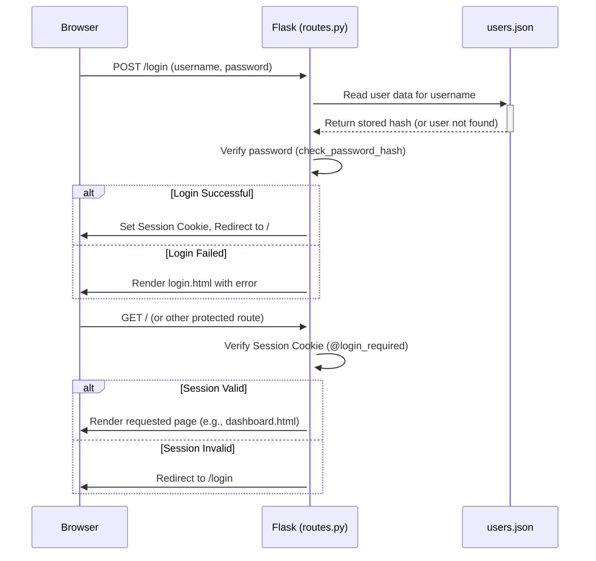
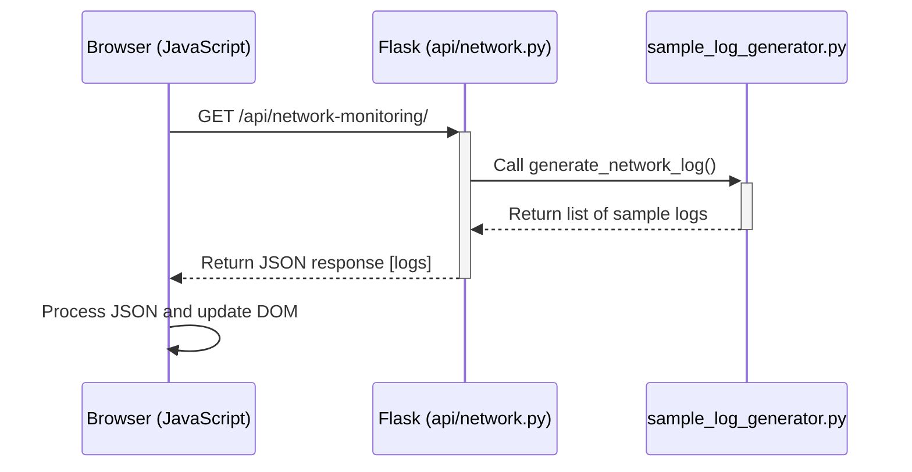
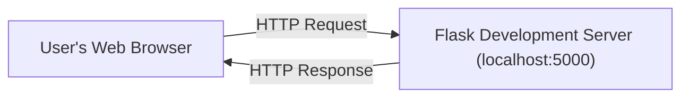

# Arkham Dashboard - Technical Documentation

**Version:** 1.0
**Date:** 2025-04-22

## Table of Contents

1.  [Introduction](#1-introduction)
2.  [System Architecture](#2-system-architecture)
    *   [2.a. Detailed Design Specifications](#2a-detailed-design-specifications)
    *   [2.b. Component Interactions](#2b-component-interactions)
    *   [2.c. Security Controls](#2c-security-controls)
    *   [2.d. Data Flow Diagrams](#2d-data-flow-diagrams)
    *   [2.e. Network Topology](#2e-network-topology)
    *   [2.f. Integration Points](#2f-integration-points)
    *   [2.g. Security Mechanisms](#2g-security-mechanisms)
3.  [Implementation Details](#3-implementation-details)
    *   [3.a. Technical Specifications](#3a-technical-specifications)
    *   [3.b. Configuration Details](#3b-configuration-details)
    *   [3.c. Deployment Procedures](#3c-deployment-procedures)
    *   [3.d. Testing Protocols](#3d-testing-protocols)
    *   [3.e. Security Validation](#3e-security-validation)
    *   [3.f. Performance Metrics](#3f-performance-metrics)
    *   [3.g. Error Handling](#3g-error-handling)

---

## 1. Introduction

The Arkham Dashboard is a web-based application designed to provide a centralized interface for monitoring various simulated security and operational data streams within a fictional high-security facility (Arkham Asylum). It presents data related to network activity, server logs, video surveillance, biometric access, physical security events, internal communications, and inmate threats.

This document provides a detailed technical overview of the application's architecture and implementation. It is intended for developers, system administrators, and technical stakeholders who need to understand the system's design, components, security, and operational procedures.

**Note:** This application currently utilizes generated sample data for all its data streams and is designed primarily for local demonstration and development purposes. It does not connect to real-time data sources or external systems.

---

## 2. System Architecture

This section details the overall structure and design of the Arkham Dashboard application.

### 2.a. Detailed Design Specifications

The Arkham Dashboard is built using the **Flask** microframework for Python. Its architecture emphasizes modularity through the use of **Flask Blueprints**.

*   **Application Structure:** The core application is initialized in `app/__init__.py`. This factory function (`create_app`) sets up the Flask application instance and registers all necessary blueprints.
*   **Blueprints:**
    *   **Frontend (`app/routes.py`):** Handles user-facing routes, including authentication (login, registration, logout) and rendering HTML pages for the dashboard and various log views. It uses the `frontend` blueprint name.
    *   **API Endpoints (`app/api/`):** Each data category (e.g., network, server logs, video surveillance) has its own blueprint defined in a separate Python file within the `app/api/` directory (e.g., `app/api/network.py`, `app/api/server_logs.py`). These blueprints define routes under specific URL prefixes (e.g., `/api/network-monitoring`, `/api/server-logs`) that serve generated sample data in JSON format.
*   **Templating:** The application uses the **Jinja2** templating engine (Flask's default) to render dynamic HTML pages. Templates are located in the `app/templates/` directory. A base template (`base.html`) provides the common layout, and specific pages extend this base.
*   **Static Files:** Static assets like CSS stylesheets (`app/static/css/`), JavaScript files (`app/static/js/`), and icons (`app/static/icon/`) are served directly by Flask from the `app/static/` directory.
*   **Authentication:** User authentication is handled via **Flask sessions**.
    *   User registration and login logic resides in `app/routes.py`.
    *   User credentials (username and hashed password) are stored in a simple JSON file: `app/users.json`.
    *   Password hashing is performed using `werkzeug.security.generate_password_hash` and `check_password_hash`.
    *   Authenticated sessions are maintained using signed cookies, managed by Flask based on the application's `SECRET_KEY`.
    *   Route protection is implemented using a `@login_required` decorator (defined in `app/routes.py`) which checks for a valid user session before allowing access to protected pages.

### 2.b. Component Interactions

The application follows a typical client-server interaction model, primarily between the user's browser (client) and the Flask application (server).

1.  **User Authentication:**
    *   User navigates to `/login` or `/register`.
    *   Flask (`app/routes.py`) renders the corresponding HTML template (`login.html` or `register.html`).
    *   User submits credentials via an HTML form POST request.
    *   Flask validates credentials against `app/users.json` (using `check_password_hash`) or creates a new user entry (using `generate_password_hash`).
    *   Upon successful login, Flask establishes a session (`session['user_id'] = username`) and redirects the user to the dashboard (`/`).
2.  **Page Rendering & Data Fetching:**
    *   User navigates to a protected page (e.g., `/`, `/network`).
    *   The `@login_required` decorator verifies the user's session. If valid, the corresponding Flask route function in `app/routes.py` is executed.
    *   Flask renders the appropriate HTML template (e.g., `dashboard.html`, `network.html`) using Jinja2.
    *   The rendered HTML page is sent to the user's browser.
    *   Frontend JavaScript (`app/static/js/dashboard.js`, `log-view.js`, etc.) executes in the browser upon page load.
    *   The JavaScript makes asynchronous `fetch` requests to the relevant backend API endpoints (e.g., `/api/network-monitoring/`, `/api/server-logs/`).
    *   The corresponding Flask API blueprint function (e.g., `get_network_logs` in `app/api/network.py`) is executed.
    *   The API function calls the appropriate `sample_log_generator` function to create sample data.
    *   The API endpoint returns the generated data as a JSON response.
    *   The frontend JavaScript receives the JSON data and dynamically updates the HTML page content (e.g., populating log tables).

### 2.c. Security Controls

Several security controls are implemented within the application, primarily focused on authentication and access control:

*   **Password Hashing:** User passwords are not stored in plaintext. The `werkzeug.security` library is used to generate salted hashes (`generate_password_hash`) for storage in `app/users.json` and to verify passwords during login (`check_password_hash`). This prevents direct exposure of passwords if the `users.json` file is compromised.
*   **Session Management:** Flask's built-in session mechanism is used to manage user login states. Sessions rely on cryptographically signed cookies stored in the user's browser. The signing requires a `SECRET_KEY` configured in `app/__init__.py`. This prevents users from tampering with their session data.
*   **Route Protection:** The `@login_required` decorator ensures that only authenticated users (those with a valid session cookie) can access protected routes (e.g., the dashboard and log viewing pages). Unauthorized access attempts are redirected to the login page.
*   **CSRF Protection (Implicit):** While not explicitly configured with Flask-WTF or similar libraries, standard Flask session handling provides a degree of protection against Cross-Site Request Forgery (CSRF) for session-modifying actions if forms are used correctly, but dedicated CSRF tokens would provide stronger protection, especially if actions were triggered by methods other than standard form posts.
*   **Security Limitations (`users.json`):**
    *   Storing user data in a JSON file (`app/users.json`) within the application directory is **not suitable for production environments**. It lacks robustness, scalability, and standard database security features.
    *   File permissions on `users.json` are critical; if the file is world-readable or writable by the web server process beyond what's necessary, it poses a security risk.
    *   There is no built-in mechanism for password complexity enforcement, account lockout after failed attempts, or password rotation policies.

### 2.d. Data Flow Diagrams

The following diagrams illustrate the key data flows within the application.

**User Authentication Flow:**



**API Data Retrieval Flow (Example: Network Logs):**



### 2.e. Network Topology

When run locally for development or demonstration, the network topology is very simple:



*   **Client:** The user's web browser accesses the application.
*   **Server:** The Flask application runs on the local machine using Flask's built-in development server (typically accessible via `http://127.0.0.1:5000` or `http://localhost:5000`).
*   **Network:** Communication occurs over the local loopback network interface.

There are no external network dependencies for core functionality, as all data is generated internally by the `sample_log_generator`. Internet access might only be required for fetching external libraries if not already installed or potentially for CDN-hosted assets if they were used (though none are currently configured). This application is not designed or configured for deployment in a complex network environment (e.g., behind load balancers, firewalls, or in a distributed cloud setup).

### 2.f. Integration Points

The primary integration points are internal to the application itself:

1.  **Frontend JavaScript <-> Backend API:** This is the main integration point. JavaScript running in the user's browser (`app/static/js/`) makes HTTP requests (using `fetch`) to the Flask API endpoints defined in `app/api/`. These APIs return generated sample data in JSON format, which the JavaScript then uses to populate the user interface.
2.  **Flask Routes <-> Jinja2 Templates:** The Flask routes in `app/routes.py` integrate with the Jinja2 templating engine to render dynamic HTML pages stored in `app/templates/`.
3.  **Flask Routes/APIs <-> Sample Log Generator:** Both the frontend routes (indirectly via templates that might trigger JS) and the API endpoints directly integrate with the `app/api/sample_log_generator.py` module to obtain the simulated data.
4.  **Authentication Logic <-> `users.json`:** The login and registration routes in `app/routes.py` integrate with the `app/users.json` file for storing and retrieving user credentials.

**External Integrations:**

There are **no external system integrations** in the current design. The application does not connect to:
*   External databases
*   Third-party authentication providers (e.g., OAuth)
*   Real-time data feeds or message queues
*   Other microservices or external APIs

All data is self-contained and generated on-demand.

### 2.g. Security Mechanisms

This section summarizes the key security mechanisms employed, as detailed previously:

*   **Password Hashing (`werkzeug.security`):** Protects stored user passwords from direct exposure using salted hashes. See [2.c. Security Controls](#2c-security-controls).
*   **Signed Session Cookies (Flask Sessions):** Manages user authentication state securely, preventing client-side tampering. Relies on the `SECRET_KEY`. See [2.c. Security Controls](#2c-security-controls).
*   **Route Access Control (`@login_required` decorator):** Enforces authentication checks on protected pages, preventing unauthorized access. See [2.c. Security Controls](#2c-security-controls) and [2.a. Detailed Design Specifications](#2a-detailed-design-specifications).

Refer to section [2.c. Security Controls](#2c-security-controls) for a more detailed discussion, including the limitations of the current approach (especially regarding `users.json`).

---

## 3. Implementation Details

This section covers the specifics of how the Arkham Dashboard is built, configured, deployed, and tested.

### 3.a. Technical Specifications

The application is built with the following core technologies and libraries:

*   **Backend:**
    *   **Language:** Python (Version 3.x recommended)
    *   **Framework:** Flask
    *   **WSGI Utility Library:** Werkzeug (primarily for password hashing and development server)
    *   **Templating Engine:** Jinja2
*   **Frontend:**
    *   **Markup:** HTML5
    *   **Styling:** CSS3
    *   **Client-side Scripting:** JavaScript (ES6+)
*   **Data Format:** JSON (for API responses and user storage)
*   **Dependencies:**
    *   Python dependencies are listed in `requirements.txt` (primarily Flask and its dependencies). Install using `pip install -r requirements.txt`.
    *   Node.js dependencies (for testing and frontend tooling) are listed in `package.json`. Install using `npm install`. Key development dependencies include:
        *   `@babel/core`, `@babel/preset-env`: For transpiling modern JavaScript.
        *   `jest`: JavaScript testing framework.
        *   `@playwright/test`: End-to-end testing framework.
*   **Testing Tools:**
    *   **Unit Testing:** `unittest` (Python standard library, assumed for Python tests) and `Jest` (JavaScript).
    *   **Integration Testing:** Python (`unittest`/`pytest`).
    *   **End-to-End Testing:** Playwright.

### 3.b. Configuration Details

Configuration for the Arkham Dashboard is minimal, reflecting its development/demonstration focus:

*   **Flask Secret Key:**
    *   Defined in `app/__init__.py`: `app.config['SECRET_KEY'] = 'dev'`
    *   **Purpose:** Used by Flask to sign session cookies, protecting them against tampering.
    *   **Security Note:** The default value `'dev'` is **insecure** and suitable only for development. For any potential deployment (even internal), this **must** be changed to a unique, unpredictable, and secret value. It should ideally be loaded from an environment variable or a configuration file outside version control.
*   **User Storage (`app/users.json`):**
    *   **Location:** `app/users.json`
    *   **Format:** JSON object where keys are usernames and values are objects containing the password hash.
        ```json
        {
            "username": {
                "password": "hashed_password_string"
            },
            ...
        }
        ```
    *   **Purpose:** Stores user credentials for authentication.
    *   **Management:** Users are added via the `/register` endpoint. The file is read during login attempts.
    *   **Limitations:** As noted in [2.c. Security Controls](#2c-security-controls), this file-based storage is not suitable for production.
*   **Testing Configuration:**
    *   `jest.config.js`: Configures the Jest testing framework for JavaScript unit tests.
    *   `babel.config.js`: Configures Babel for JavaScript transpilation, used by Jest.
    *   `playwright.config.js`: Configures the Playwright framework for end-to-end tests.

No other external configuration files or environment variables are required for basic operation in its current state.

### 3.c. Deployment Procedures

The application is intended to be run locally using the Flask development server.

**Steps for Local Execution:**

1.  **Prerequisites:**
    *   Python 3.x installed.
    *   Node.js and npm installed (for installing testing dependencies, though not strictly required just to run the app).
2.  **Clone Repository:** Obtain the project code.
3.  **Install Python Dependencies:**
    ```bash
    pip install -r requirements.txt
    ```
4.  **(Optional) Install Node.js Dependencies:** (Needed for running tests)
    ```bash
    npm install
    ```
5.  **Run the Application:**
    ```bash
    python run.py
    ```
6.  **Access:** Open a web browser and navigate to `http://127.0.0.1:5000` (or the address provided in the terminal output).

**Production Deployment:**

This application, in its current state, is **not suitable for production deployment** due to:
*   Use of the Flask development server (not designed for performance or security under load).
*   Insecure default `SECRET_KEY`.
*   Insecure and non-scalable user storage (`users.json`).
*   Lack of robust error handling and logging for production environments.

For production, a proper WSGI server (like Gunicorn or uWSGI) behind a reverse proxy (like Nginx or Apache), a secure database for user storage, proper secret management, and comprehensive logging would be required.

### 3.d. Testing Protocols

The project employs a multi-layered testing strategy to ensure code quality and functionality:

*   **Unit Tests (`tests/unit/`):**
    *   **Purpose:** Verify the correctness of individual functions, methods, or classes in isolation.
    *   **Python (`tests/unit/api/`, `tests/unit/test_auth.py`):** Tests focus on API data generation logic, authentication functions (`load_users`, `save_users`, password hashing checks), etc. Assumed to use Python's `unittest` or `pytest`.
    *   **JavaScript (`tests/unit/frontend/`):** Tests focus on client-side utility functions, data manipulation, or potentially UI component logic (if using a framework). Uses the **Jest** framework (`jest.config.js`, `babel.config.js`). Run using `npm test` or `npx jest`.
*   **Integration Tests (`tests/integration/`):**
    *   **Purpose:** Verify the interaction between different components of the application, typically within the backend.
    *   **Python (`tests/integration/test_dashboard_page.py`):** Tests check if Flask routes render the correct templates, if blueprints are registered correctly, or if API endpoints return expected status codes/basic structures when called internally. Uses Flask's test client.
*   **End-to-End (E2E) Tests (`tests/e2e/`):**
    *   **Purpose:** Simulate real user workflows through the browser to verify the complete application flow from the user's perspective.
    *   **Framework:** Uses **Playwright** (`playwright.config.js`).
    *   **Examples (`auth.spec.js`, `dashboard.spec.js`):** Tests cover user registration, login, logout, navigation between pages, and potentially verifying that data fetched from APIs is displayed correctly on the dashboard. Run using `npx playwright test`.

This comprehensive approach helps catch bugs at different levels, from isolated logic errors to issues in component interactions and full user workflow failures.

### 3.e. Security Validation

Security features, particularly authentication and authorization, are primarily validated through:

*   **Unit Tests:** Tests in `tests/unit/test_auth.py` likely verify the password hashing functions (`check_password_hash`) work correctly against known hashes.
*   **Integration Tests:** Tests could potentially check if the `@login_required` decorator correctly redirects unauthenticated requests, although this is often better covered by E2E tests.
*   **End-to-End Tests:** The E2E tests (`tests/e2e/auth.spec.js`) are crucial for security validation. They explicitly test:
    *   Successful login with valid credentials.
    *   Failed login attempts with incorrect usernames or passwords.
    *   Successful registration.
    *   Preventing registration with an existing username.
    *   Accessing protected pages (e.g., dashboard) after login.
    *   Attempting to access protected pages without logging in (expecting redirection to login).
    *   Successful logout and subsequent inability to access protected pages.

**Limitations:**
*   The tests validate the *implemented* security mechanisms function as expected.
*   They do **not** inherently validate against vulnerabilities not covered by the implemented controls (e.g., specific injection attacks if input sanitization were insufficient, although less relevant here).
*   The fundamental security weakness of using `users.json` for credential storage, as discussed in [2.c. Security Controls](#2c-security-controls), is an architectural limitation not typically "validated" by these tests, but rather acknowledged.
*   Tests do not currently cover aspects like session timeout, session fixation prevention (though Flask's default session mechanism helps), or brute-force protection on login.

### 3.f. Performance Metrics

Formal performance metrics (e.g., requests per second, response time under load, database query times) are **not actively tracked or relevant** for this application in its current state.

**Reasons:**

1.  **Development Server:** The application runs on the Flask development server, which is not optimized for performance and is single-threaded by default.
2.  **Sample Data:** All data is generated on-the-fly by Python functions (`sample_log_generator`). There are no database interactions, network calls to external services, or complex computations that would typically be bottlenecks requiring performance monitoring.
3.  **Intended Use:** The application is designed for local demonstration and development, not high-load production use.

Performance is primarily dictated by the efficiency of the log generation functions and the resources of the local machine running the Flask server. If the application were to be adapted for real data sources and production deployment, performance testing and monitoring would become essential.

### 3.g. Error Handling

Error handling is implemented at different levels:

*   **Flask/Werkzeug:**
    *   Handles standard HTTP errors (e.g., 404 Not Found, 500 Internal Server Error) with default error pages. Custom error pages can be defined using `@app.errorhandler()` decorators, but are not currently implemented beyond Flask's defaults.
    *   Unhandled exceptions within route handlers will typically result in a 500 Internal Server Error. In development mode (`DEBUG=True`), Flask provides an interactive debugger; in production mode (`DEBUG=False`), a generic 500 page is shown.
*   **Application-Specific Errors (`app/routes.py`):**
    *   User-facing errors during login or registration (e.g., "Incorrect username.", "Password is required.") are handled explicitly within the route functions.
    *   Flask's `flash()` mechanism is used to send short messages to the user, which are typically displayed in the base template (`base.html`) on the next request. This provides feedback on the success or failure of actions.
*   **Frontend JavaScript (`app/static/js/`):**
    *   The JavaScript code making `fetch` requests to the backend APIs should ideally include error handling (`.catch()` blocks or `try...catch` with `async/await`).
    *   This would handle network errors (e.g., server unavailable) or cases where the API returns an error status code (e.g., 4xx, 5xx).
    *   Currently, error handling in the frontend JavaScript might be minimal, as the sample data generation is expected to be reliable. Robust handling would involve displaying user-friendly error messages if API calls fail.
*   **API Endpoints (`app/api/`):**
    *   The current API endpoints primarily generate data and are unlikely to encounter significant errors. If they were interacting with external resources or databases, more robust error handling (e.g., `try...except` blocks, returning appropriate HTTP error codes like 500 or 503) would be necessary.
